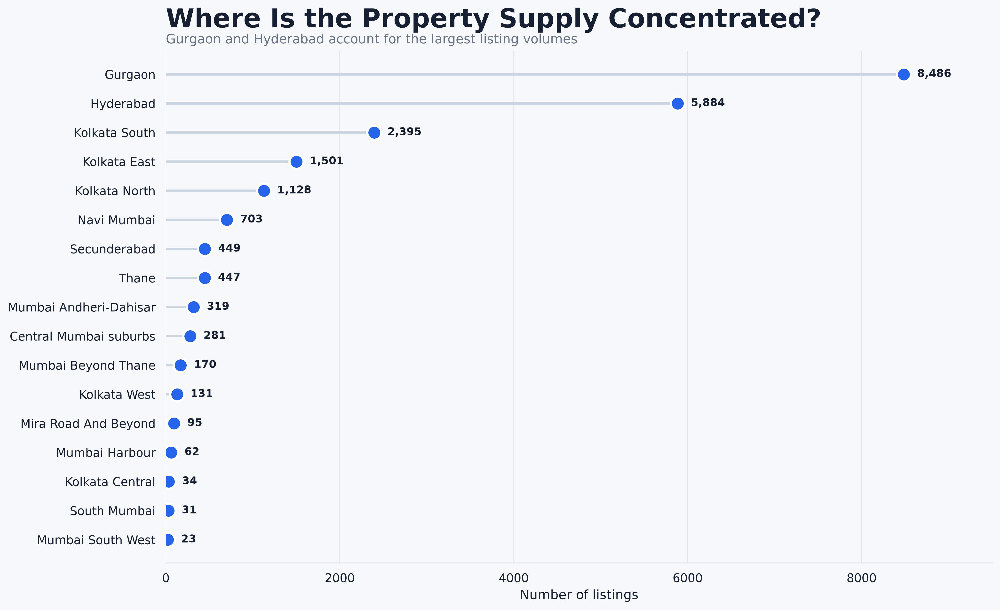
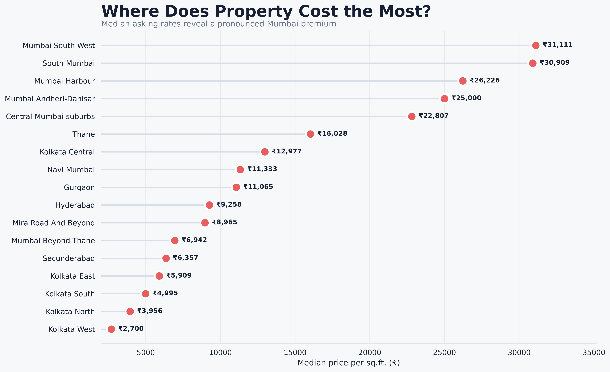
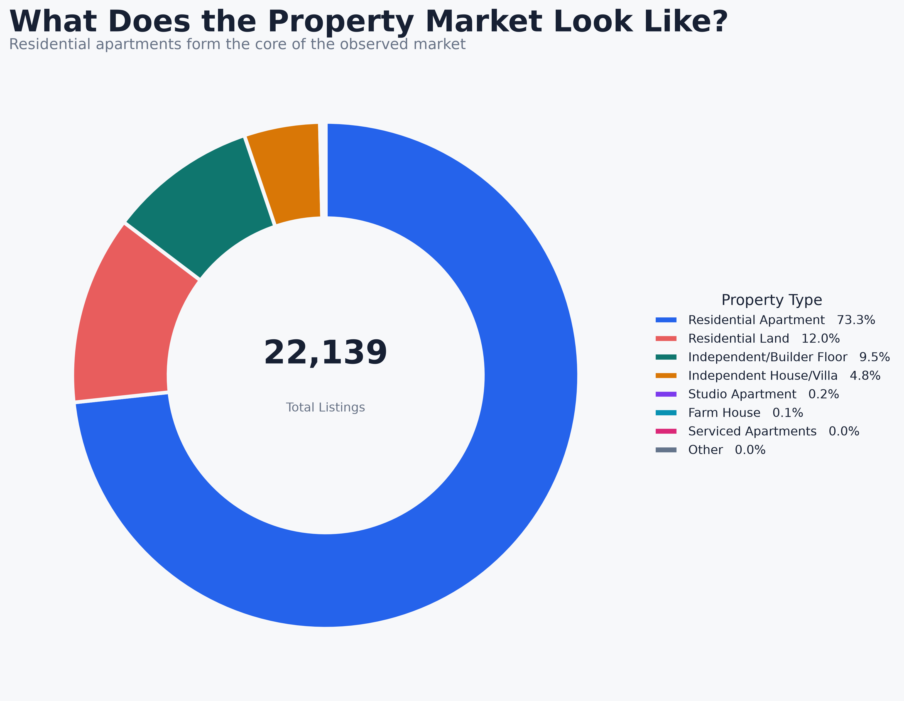
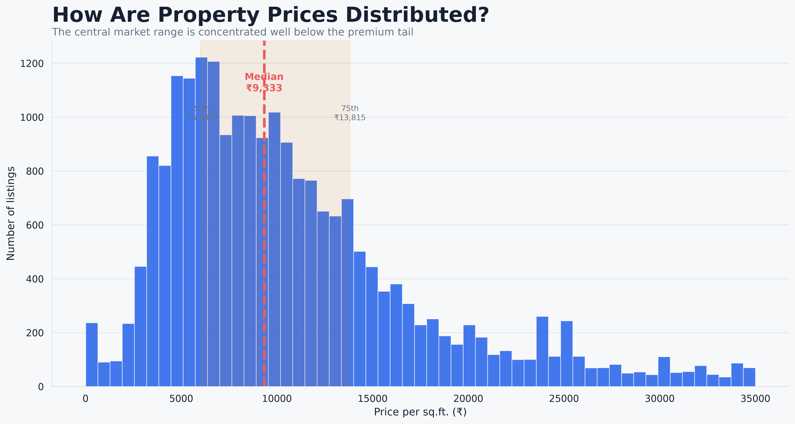
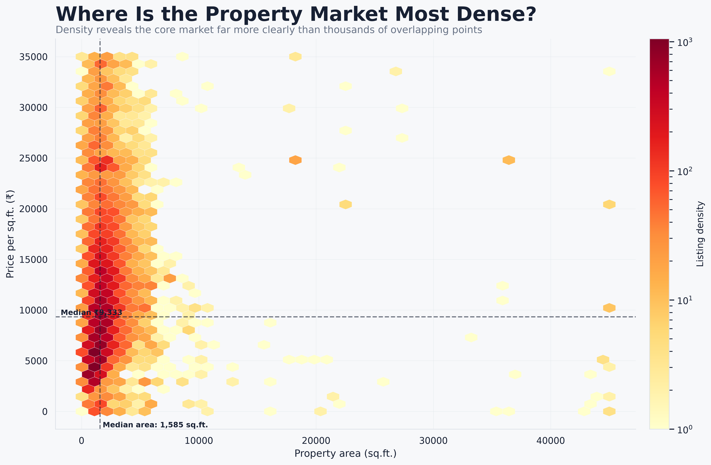
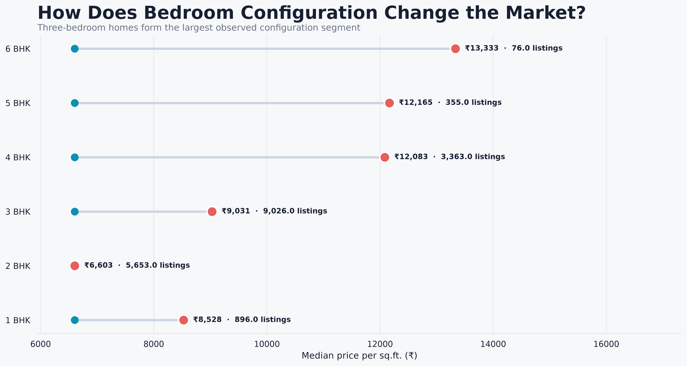
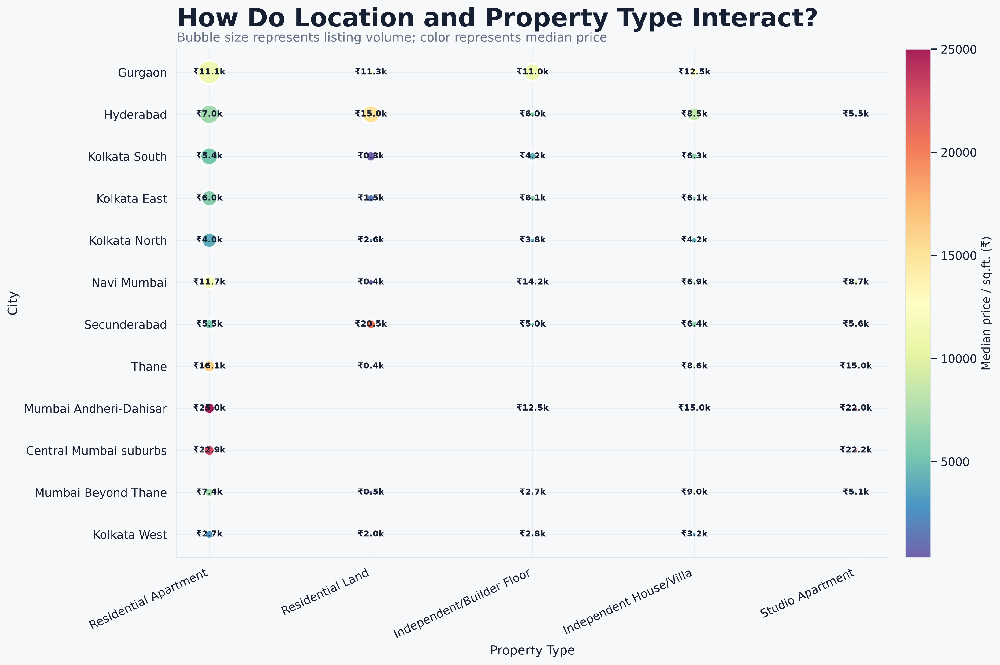
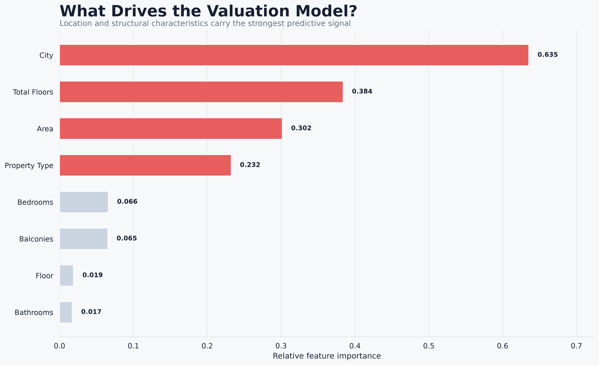

# 🏛️ EstateIQ — Real Estate Analytics & Property Valuation

> An end-to-end real estate analytics platform combining data quality, EDA, SQL market intelligence, machine learning, and an interactive Streamlit valuation dashboard.

<p align="center">
  <a href="https://estateiq-real-estate-analytics-aygg3xukbui6tevqxrrts3.streamlit.app/">
    
  </a>
</p>

<p align="center">
  <a href="https://estateiq-real-estate-analytics-aygg3xukbui6tevqxrrts3.streamlit.app/">
    <strong>🔴 Open Live EstateIQ Dashboard →</strong>
  </a>
</p>

## 🌐 Live Dashboard

Explore the deployed EstateIQ application:

<p align="center">
  <a href="https://estateiq-real-estate-analytics-aygg3xukbui6tevqxrrts3.streamlit.app/">
    
  </a>
</p>

The live dashboard provides an interactive view of:

- 🏠 Property valuation
- 📊 Market analytics
- 📍 City-level pricing
- 🏢 Property-type analysis
- 📐 Area and price relationships
- 🛏️ Bedroom-level analysis
- 🤖 Model performance
- 🔎 Feature importance
- 💡 Data-driven market insights

**Live Application:**  
https://estateiq-real-estate-analytics-aygg3xukbui6tevqxrrts3.streamlit.app/        

## ✨ Highlights

- 📊 Analysis of **22,139 property records**
- 📍 **17 locations** and **8 property categories**
- 🧹 Data cleaning, validation, and area outlier treatment
- 🗄️ SQLite database and reusable SQL analytics
- 📈 Professional EDA and market visualizations
- 🤖 Random Forest property valuation
- 🖥️ Interactive Streamlit dashboard
- 💡 Business-focused market insights
- 🔎 Model feature-importance analysis
- 💾 Reproducible processed dataset and saved ML pipeline

## 📌 Dataset Snapshot

| Metric | Value |
|---|---:|
| Property Records | **22,139** |
| Locations | **17** |
| Property Types | **8** |
| Unique Property IDs | **22,139** |
| Duplicate Records | **0** |
| Valid Area Records | **22,139** |
| Valid Price Records | **22,139** |
| Average Area | **1,961 sq.ft.** |
| Area Range | **33–45,000 sq.ft.** |
| Price Range | **₹1–₹35,000 / sq.ft.** |

### Largest Segments

**Locations**
- Gurgaon — 8,486 listings
- Hyderabad — 5,884
- Kolkata South — 2,395
- Kolkata East — 1,501
- Kolkata North — 1,128

**Property Types**
- Residential Apartment — 16,226
- Residential Land — 2,665
- Independent/Builder Floor — 2,096
- Independent House/Villa — 1,071

## 🔄 Project Workflow

```text
Raw Property Data
        ↓
Data Cleaning & Validation
        ↓
Feature Preparation
        ↓
Exploratory Data Analysis
        ↓
SQLite Database
        ↓
SQL Market Analysis
        ↓
Business Insights
        ↓
Machine Learning
        ↓
Property Valuation Model
        ↓
Streamlit Dashboard
```

## 🧹 Data Quality

The project validates:

- Record counts
- Duplicate property IDs
- Missing analytical fields
- Numeric ranges
- Invalid area and price values
- City distribution
- Property-type distribution
- Extreme observations

Final validation:

- **22,139 valid AREA records**
- **22,139 valid PRICE_SQFT records**
- **0 duplicate property IDs**

Area outliers are handled during the cleaning stage. The cleaned `AREA` is then passed to the ML workflow without a second clipping operation.

## 📊 Market Intelligence

SQL and notebook analysis cover:

- City pricing
- Median and average price/sq.ft.
- Market share
- Property-type pricing
- Area distributions
- Bedroom and bathroom patterns
- City/property-type combinations
- Price premiums
- Price indices
- Opportunity scoring
- Business-oriented market segments

### Selected Findings

- Gurgaon represents **38.33%** of the dataset.
- Hyderabad represents **26.58%**.
- Residential Apartments represent **73.29%** of records.
- Mumbai locations generally show higher observed price/sq.ft. levels than the analyzed Kolkata markets.
- Residential Land has a higher median observed price/sq.ft. than Residential Apartments in this dataset.

## 🤖 Machine Learning

EstateIQ uses a **Random Forest regression pipeline** to estimate indicative property price/sq.ft.

### Model Features

- City
- Property Type
- Bedrooms
- Bathrooms
- Balconies
- Floor
- Total Floors
- Area

### Valuation

```text
Predicted Price / sq.ft.
            ×
       Property Area
            =
Estimated Property Value
```

### Current Model Benchmark

| Metric | Result |
|---|---:|
| R² | **0.6132** |
| MAE | **₹2,593.72** |
| RMSE | **₹3,948.72** |

These are model evaluation metrics, not a guarantee of actual market value.

## 🖥️ Streamlit Dashboard

Run:

```bash
streamlit run app.py
```

The dashboard provides:

- Interactive property inputs
- Indicative price prediction
- Estimated total property value
- City-level market analysis
- Property-type comparison
- Area vs. price analysis
- Bedroom-level pricing
- Price-band analysis
- Model feature importance
- Interactive Plotly visualizations

## 📊 Market Analytics

EstateIQ uses a focused set of visualizations to explain market supply, pricing, property composition, feature relationships, and model behavior.

### 🏙️ Market Supply by City

<p align="center">
  
</p>

Gurgaon and Hyderabad account for the largest share of property listings in the dataset, providing the strongest representation of the analyzed markets.

### 💰 Median Property Price by City

<p align="center">
  
</p>

The city-level comparison highlights substantial differences in observed median price per square foot across locations.

### 🏢 Property Market Composition

<p align="center">
  
</p>

Residential Apartments form the dominant property category, followed by Residential Land and Independent/Builder Floor listings.

### 📈 Property Price Distribution

<p align="center">
  
</p>

The distribution shows how observed property prices are concentrated across different price-per-square-foot ranges.

### 📐 Area vs. Price Relationship

<p align="center">
  
</p>

The visualization explores the relationship between property area and observed price per square foot across the dataset.

### 🛏️ Bedroom-Level Market Comparison

<p align="center">
  
</p>

Bedroom-level analysis compares market supply and median pricing across different bedroom configurations.

### 🗺️ City × Property Type Pricing Matrix

<p align="center">
  
</p>

The matrix highlights how observed median prices vary simultaneously by location and property category.

### 🤖 Model Feature Importance

<p align="center">
  
</p>

The model analysis shows which property and location features contribute most strongly to the Random Forest valuation model.
## 📈 Visual Analytics

Presentation-ready charts are stored in:

```text
notebooks/assets/charts/
```

The main analytical visuals include:

- City price comparison
- Property-type market composition
- Area vs. price relationship
- Bedroom-level price analysis
- Price-band distribution
- Model feature importance

## 🗄️ SQL Analytics

Database:

```text
data/estateiq.db
```

Main table:

```text
estateiq_processed
```

SQL files:

```text
sql/
├── 01_data_quality.sql
├── 01b_price_quality.sql
├── 02_market_analysis.sql
├── 03_location_analysis.sql
├── 04_property_analysis.sql
└── 05_business_insights.sql
```

Run them with:

```powershell
python run_sql.py 01_data_quality.sql
python run_sql.py 01b_price_quality.sql
python run_sql.py 02_market_analysis.sql
python run_sql.py 03_location_analysis.sql
python run_sql.py 04_property_analysis.sql
python run_sql.py 05_business_insights.sql
```

## 📂 Project Structure

```text
EstateIQ-real-estate-analytics/
│
├── app.py
├── README.md
├── requirements.txt
├── run_sql.py
├── estateiq_database.py
│
├── data/
│   ├── processed/
│   │   └── estateiq_processed.csv
│   └── estateiq.db
│
├── models/
│   └── property_valuation_rf.pkl
│
├── notebooks/
│   ├── estateiq_analysis.ipynb
│   └── assets/
│       └── charts/
│           ├── 01_market_supply_by_city.png
│           ├── 02_median_price_by_city.png
│           ├── 03_property_market_composition.png
│           ├── 04_price_distribution.png
│           ├── 05_area_price_density.png
│           ├── 06_bedroom_market_comparison.png
│           ├── 07_city_property_type_matrix.png
│           └── 08_model_feature_importance.png
│
└── sql/
    ├── 01_data_quality.sql
    ├── 01b_price_quality.sql
    ├── 02_market_analysis.sql
    ├── 03_location_analysis.sql
    ├── 04_property_analysis.sql
    └── 05_business_insights.sql
```        
## ⚙️ Installation

### 1. Clone

```bash
git clone <YOUR_GITHUB_REPOSITORY_URL>
cd EstateIQ-real-estate-analytics
```

### 2. Create environment

**Windows**

```powershell
python -m venv .venv
.venv\Scripts\activate
```

**macOS / Linux**

```bash
python3 -m venv .venv
source .venv/bin/activate
```

### 3. Install dependencies

```bash
pip install -r requirements.txt
```

## 🗃️ Rebuild Database

After updating the processed dataset:

```bash
python estateiq_database.py
```

The SQLite database will be created at:

```text
data/estateiq.db
```

## 📊 Analytical Questions

EstateIQ focuses on practical questions such as:

### Market
**Which locations have the highest listing volume?**

Gurgaon and Hyderabad dominate the analyzed dataset.

### Pricing
**Which locations have higher observed price levels?**

Mumbai locations generally show substantially higher observed price/sq.ft. levels than the analyzed Kolkata locations.

### Property Type
**What is the dominant property category?**

Residential Apartment is the dominant category, accounting for more than 16,000 records.

### Configuration
**How does bedroom count relate to property size and pricing?**

Higher-bedroom configurations generally correspond to larger average areas and often higher observed price/sq.ft., although the relationship is not perfectly linear.

### Valuation
**Can property characteristics be used to estimate price?**

Yes. The Random Forest model learns patterns between property characteristics and observed price/sq.ft. to produce an indicative estimate.

## ⚠️ Important Note

EstateIQ is an **analytics and portfolio project**, not a certified property appraisal system.

Predictions are based on patterns in the analyzed dataset. Actual property values can vary because of:

- Exact locality
- Building quality
- Property condition
- Amenities
- Road access
- Legal status
- Developer reputation
- Market timing
- Negotiation
- Other micro-location factors

Use the valuation as an analytical estimate rather than a guaranteed transaction price.

## 🛠️ Technology Stack

| Area | Technology |
|---|---|
| Language | Python |
| Data Processing | Pandas, NumPy |
| Visualization | Matplotlib, Seaborn, Plotly |
| Statistics | SciPy, Statsmodels |
| Machine Learning | Scikit-learn, XGBoost |
| Explainability | SHAP |
| Model Persistence | Joblib |
| Database | SQLite |
| Dashboard | Streamlit |
| Notebook | Jupyter |
| Spreadsheet | OpenPyXL |

## 📦 Requirements

```text
pandas
numpy
matplotlib
seaborn
plotly
scikit-learn
scipy
statsmodels
xgboost
shap
joblib
streamlit
jupyter
openpyxl
```

Install:

```bash
pip install -r requirements.txt
```

## 🎯 Objective

EstateIQ demonstrates how real-estate data can be transformed into a complete analytical product:

**Data → Cleaning → EDA → SQL → Insights → ML → Dashboard**

The project focuses not only on prediction, but also on understanding the market, validating the data, communicating findings visually, and delivering an interactive analytical application.

## 👤 Author

**Devendra Upadhyay**

Data Analytics · Python · SQL · Machine Learning · Data Visualization

## 📄 License

This project is intended for educational, portfolio, and analytical purposes.
